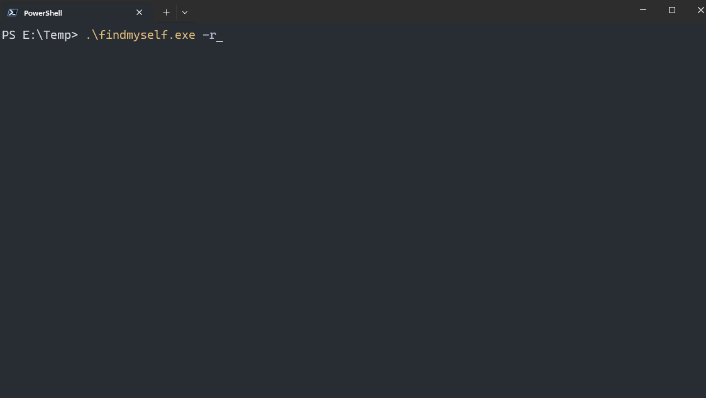

# goFindMyself
For Golang learning and memory practices.

## Usage



### Generate Random Numbers

```
PS C:\goFindMyself> .\findmyself.exe -h
Usage of E:\goFindMyself\findmyself.exe:
  -c int
        count of random numbers. (default 30)
  -db string
        database filename (default "data.db")
  -hint int
        show hints when recall tests fail: 0 for no hint, 1 for diff hint, 2 for full hint (default 2)
  -m int
        maxium for random numbers. (default 100)
  -r    recall test mode.
  -s    store generated numbers for recall tests. (default true)
  -u    all generated numbers will be unique. (default true)
```

If running without any parameters, this program generates 30 random numbers in range of (0,100).
```
PS E:\goFindMyself> .\findmyself.exe
2024-02-19 18:24:03 Random Number Generated:
72 14 31 44 64 6  57 39 41 18
51 88 42 25 27 0  84 58 97 47
24 59 33 21 94 16 76 43 89 32

```


### Memory Practice

If you're confident you've memorized the generated random number, you can add the `-r` parameter for a memory test.
```
PS E:\goFindMyself> .\findmyself.exe -r
What do you remember?
96 19 40 13 2 9 83 70 61 82 76 79 80 31 16 7 48 58 33 86 1 56 72 47 99 17 92 68 57 60

You have entered: 96 19 40 13 2 9 83 70 61 82 76 79 80 31 16 7 48 58 33 86 1 56 72 47 99 17 92 68 57 60
You have a correct memory!
checkRecall took 70.30s!
```